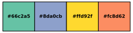
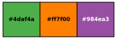

# Qualpal <picture><source media="(prefers-color-scheme: light)" srcset="https://raw.githubusercontent.com/jolars/qualpal/refs/heads/main/docs/images/logo.svg" align="right" width="139">  </picture>

[](https://github.com/jolars/qualpal/actions/workflows/build-and-test.yml)
[](https://codecov.io/gh/jolars/qualpal)
[](https://jolars.github.io/qualpal/)
[](https://doi.org/10.5281/zenodo.17194762)
[](https://cran.r-project.org/package=qualpalr)
[](https://qualpal.cc)
[](https://doi.org/10.21105/joss.08936)

A C++ library for generating qualitative color palettes with maximum perceptual
distinctiveness, especially for data visualization. The API uses a
builder-style interface for flexible palette configuration, supporting multiple
input formats, color vision deficiency simulation, and perceptual color
difference metrics.

Full documentation is available at
[https://jolars.github.io/qualpal/](https://jolars.github.io/qualpal/).

This library is also available as

- an R package called
  [qualpalr](https://cran.r-project.org/package=qualpalr),
- as a python package called [qualpal](https://pypi.org/project/qualpal/),
- and as a web
  application at [qualpal.cc](https://qualpal.cc).

## Features

- Automatic selection of color palettes using perceptual color difference metrics
- Color vision deficiency simulation for accessible palette design
- Multiple input formats: RGB values, hex strings, HSL ranges, built-in palettes
- Fast algorithms for large color spaces
- Builder-style C++ API for flexible palette configuration
- Web-Based Interface for simple and interactive color palette generation

## Table of Contents

- [Features](#features)
- [Motivation](#motivation)
- [R Package](#r-package)
- [Web App](#web-app)
- [Quick Start](#quick-start)
- [Installation](#installation)
- [Usage Examples](#usage-examples)
- [Contributing](#contributing)
- [Versioning](#versioning)
- [License](#license)

## Motivation

When visualizing categorical data, it is often necessary to select a set of
distinct colors that are easily distinguishable from each other. This is
especially important for accessibility, as many people have color vision
deficiencies (CVD) that make it difficult to distinguish certain colors.
Qualpal aims to provide a simple and effective way to generate such color
palettes, ensuring that the selected colors are not only distinct from each
other, but also accessible to people with CVD.

The problem with almost all standard color palettes is that they are optimized
for a specific number of colors. This is of course a problem by
design, since a good 10-color palette has to be designed with the assumption
that it will be used as a whole, not that it will be used in parts. But it
means that if you want to select a subset of colors from a palette, you will
not get the best possible result.

They are also often created by a human designer, which means that they may not
be optimized for perceptual distinctiveness. Qualpal, on the other hand, uses
state-of-the art color difference metrics and a farthest-point sampling
algorithm to select colors that are (approximately) maximally distinct from
each other, while also considering color vision deficiencies.

## R Package

The Qualpal library is also available as an R package called
[qualpalr](https://cran.r-project.org/package=qualpalr). This package
is continuously updated to match the latest features of the C++ library,
but may sometimes lag behind slightly. It provides a similar API for
generating colors from R, making it easy to integrate Qualpal into R workflows,

## Web App

Qualpal is also available as a web application at
[qualpal.cc](https://qualpal.cc). The web app has slightly
limited functionality compared to the library and R package, but it allows
users to quickly generate color palettes directly in their browser.

## JOSS Paper

Qualpal has been [published in JOSS](https://doi.org/10.21105/joss.08936).
You can read more about the motivation and design of qualpal in the paper.
If you find qualpal useful in your research, please consider citing it (either
using the DOI badge, the GitHub citation tool, or by referring directly
to <CITATION.cff>.

## Quick Start

### Library Usage

Generate 5 colors from a HSL colorspace:

```cpp
#include <qualpal.h>

using namespace qualpal;

Qualpal qp;
qp.setInputColorspace({ -170, 60 }, { 0, 0.7 }, { 0.2, 0.8 });
auto colorspace_pal = qp.generate(5);
```


Generate colors from multiple colorspace regions (e.g., warm and cool colors only):

```cpp
qp.setInputColorspaceRegions(
  {
    { { 0, 60 }, { 0.5, 1.0 }, { 0.3, 0.7 } },   // Warm: reds/oranges/yellows
    { { 180, 240 }, { 0.5, 1.0 }, { 0.3, 0.7 } } // Cool: cyans/blues
  },
  ColorspaceType::HSL);
auto multi_region_pal = qp.generate(8);
```

Select 2 colors from given RGB values:

```cpp
qp.setInputRGB({ colors::RGB("#ff0000"),
                 colors::RGB("#00ff00"),
                 colors::RGB("#0000ff") });
auto rgb_pal = qp.generate(2);
```


Consider color vision deficiency (CVD) when generating colors

```cpp
qp.setInputPalette("ColorBrewer:Set2").setCvd({ { "deutan", 0.7 } });
auto cvd_pal = qp.generate(4);
```



### Command Line Interface (CLI)

qualpal includes a powerful command line interface for palette generation and analysis.
For a full list of options and usage examples, run:

```sh
qualpal --help
```

There are also man pages available for the CLI:

```sh
man qualpal
```

You can also view the [Doxygen-generated
documentation](https://jolars.github.io/qualpal/) for detailed CLI and API
usage.

#### Examples

Generate 5 colors from the HSL color space, with full hue range, medium-high
saturation (0.4-0.8), and medium lightness (0.3-0.7):

```sh
qualpal -n 5 -i colorspace "0:360" "0.4:0.8" "0.3:0.7"
```


Select from hex colors:

```sh
qualpal -n 3 "#ff0000" "#00ff00" "#0000ff" "#ffff00"
```


Extend existing palette (keep fixed colors provided after --extend):

```{sh}
qualpal -n 3 -i colorspace "0:180" "0.3:0.6" "0.7:0.9" --extend "#ff0000" "#00ff00"
```


Analyze palette with hex input:

```sh
qualpal analyze --input hex "#ffe402" "#ff5733" "#33ff57" "#3357ff"
```

    Color Difference Matrix (ciede2000 metric):
    Colors analyzed: 4
    Colors:
      Idx      Hex  MinDist
        0  #ffe402    29.52
        1  #ff5733    49.57
        2  #33ff57    29.52
        3  #3357ff    50.07

    Color Difference Matrix:
              0       1       2       3
      0     0.00   49.57   29.52   83.87
      1    49.57    0.00   78.05   50.07
      2    29.52   78.05    0.00   71.78
      3    83.87   50.07   71.78    0.00

## Installation

### Binary Packages (Recommended)

Pre-built packages and binaries are available for Linux, macOS, and Windows from [GitHub Releases](https://github.com/jolars/qualpal/releases/latest).

<details>
<summary><b>📦 Linux - Debian/Ubuntu (DEB packages)</b></summary>

#### Quick Install Script

```bash
# Automatic installation (detects your system)
curl -sSL https://raw.githubusercontent.com/jolars/qualpal/main/scripts/install.sh | bash
```

#### Manual Installation

```bash
# Download packages (replace VERSION with actual version, e.g., 3.3.0)
# For x86_64/amd64:
wget https://github.com/jolars/qualpal/releases/latest/download/libqualpal1_VERSION-1_amd64.deb
wget https://github.com/jolars/qualpal/releases/latest/download/qualpal_VERSION-1_amd64.deb

# For ARM64/aarch64:
wget https://github.com/jolars/qualpal/releases/latest/download/libqualpal1_VERSION-1_arm64.deb
wget https://github.com/jolars/qualpal/releases/latest/download/qualpal_VERSION-1_arm64.deb

# Install
sudo dpkg -i libqualpal1_*.deb qualpal_*.deb
```

**Development package:** `libqualpal-dev_VERSION-1_{amd64,arm64}.deb`

</details>

<details>
<summary><b>📦 Linux - Red Hat/Fedora/SUSE (RPM packages)</b></summary>

```bash
# Download packages (replace VERSION with actual version, e.g., 3.3.0)
# For x86_64:
wget https://github.com/jolars/qualpal/releases/latest/download/libqualpal1-VERSION-1.x86_64.rpm
wget https://github.com/jolars/qualpal/releases/latest/download/qualpal-VERSION-1.x86_64.rpm

# For ARM64/aarch64:
wget https://github.com/jolars/qualpal/releases/latest/download/libqualpal1-VERSION-1.aarch64.rpm
wget https://github.com/jolars/qualpal/releases/latest/download/qualpal-VERSION-1.aarch64.rpm

# Install
sudo rpm -i libqualpal1-*.rpm qualpal-*.rpm
```

**Development package:** `libqualpal-devel-VERSION-1.{x86_64,aarch64}.rpm`

</details>

<details>
<summary><b>🍎 macOS (Intel and Apple Silicon)</b></summary>

```bash
# Download for your Mac architecture (replace VERSION with actual version)
# For Intel Macs:
wget https://github.com/jolars/qualpal/releases/latest/download/qualpal-VERSION-Darwin-x86_64.tar.gz
tar -xzf qualpal-VERSION-Darwin-x86_64.tar.gz

# For Apple Silicon (M1/M2/M3/M4):
wget https://github.com/jolars/qualpal/releases/latest/download/qualpal-VERSION-Darwin-arm64.tar.gz
tar -xzf qualpal-VERSION-Darwin-arm64.tar.gz

# Move to your PATH (optional)
sudo mv qualpal-*/bin/qualpal /usr/local/bin/
```

Headers and libraries are included in the archive for development.

</details>

<details>
<summary><b>🪟 Windows (x64 and ARM64)</b></summary>

Download the appropriate ZIP file for your system:

- [Windows x64 (MSVC)](https://github.com/jolars/qualpal/releases/latest) - Recommended for most users
- [Windows x64 (MinGW)](https://github.com/jolars/qualpal/releases/latest) - Alternative build
- [Windows ARM64](https://github.com/jolars/qualpal/releases/latest) - For ARM-based Windows devices

**Installation:**

1. Download and extract the ZIP file
2. Add the `bin` directory to your PATH environment variable, or
3. Run `qualpal.exe` directly from the extracted location

Headers and libraries are included in the archive for development.

</details>

### Requirements

- CMake >= 3.15
- C++17 compatible compiler (e.g., GCC, Clang, MSVC)
- [Optional] OpenMP for parallelization
- [Optional] help2man for CLI man page generation
- [Optional] Catch2 for testing

### From Source

To build and install qualpal from source, you need to have CMake and a C++17
compatible C++ compiler installed. If you want the algorithm to be
parallelized, you also need to have support for OpenMP.

To build, clone the repository and run the following commands:

```sh
git clone https://github.com/jolars/qualpal.git
cd qualpal
cmake -B build -S .
cmake --build build --config Release
```

If you want to include the CLI interface, make sure to pass the
`-DBUILD_CLI=ON` option to CMake:

```sh
cmake -B build -S . -DBUILD_CLI=ON
```

Then, to install the library (and CLI, if built), use
the following command:

```sh
sudo cmake --install build
```

If you prefer to install the library in a custom location, such as your home
directory, you can specify the `--prefix` option:

```sh
cmake --install build --prefix "$HOME/.local"
```

Optionally, you can also run the CLI app directly from the build directory
without installing it:

```sh
./build/qualpal --help
```

### What Gets Installed

Under your chosen prefix (e.g., `$HOME/.local` or `/usr/local`):

- `bin/qualpal` - Command-line interface (when `BUILD_CLI=ON`)
- `include/qualpal/` - C++ header files
- `lib/libqualpal.*` (or `lib64/libqualpal.*`) - Library files
- `lib/cmake/qualpal/` - CMake package configuration
- `share/doc/qualpal/LICENSE` - License file
- `share/man/man1/qualpal.1` - Manual page

### Package Types

The binary packages are split into separate components:

- **Runtime packages** (`libqualpal1`): Contains the shared library needed to run applications that use qualpal
- **CLI packages** (`qualpal`): Contains the command-line interface - depends on the runtime package
- **Development packages** (`libqualpal-dev`/`libqualpal-devel`): Contains headers, static library, and CMake files for building applications with qualpal

This separation allows you to install only what you need:

- Just want the CLI? Install runtime + CLI packages
- Developing with qualpal? Install all three packages
- Deploying an application? Install just the runtime package

### Uninstall

To uninstall qualpal, we provide a CMake uninstall target. Run the following command:

```sh
cmake --build build --target uninstall
```

Unix users can also delete the files directly by calling

```sh
xargs rm < build/install_manifest.txt
```

### WebAssembly

To build the WebAssembly package for web applications, you need
to first install [Emscripten](https://emscripten.org/docs/getting_started/downloads.html).

Then, you can build the package with the following commands:

```sh
emcmake cmake -B build/wasm -S . -DBUILD_WASM=ON -DCMAKE_BUILD_TYPE=Release
emmake make -C build/wasm qualpal_wasm
```

### CMake Integration

qualpal can be easily integrated into your CMake projects. After building and
installing the library, you can find it using CMake's `find_package` command.

```cmake
find_package(qualpal REQUIRED)
target_link_libraries(your_target qualpal::qualpal)
```

If you installed qualpal in a custom location, make sure to set the
`CMAKE_PREFIX_PATH` variable first to include the installation prefix, e.g.:

```cmake
set(CMAKE_PREFIX_PATH "$ENV{HOME}/.local") # Or your custom prefix
```

## Usage Examples

### Basic Color Selection

```cpp
#include <iostream>
#include <qualpal.h>

using namespace qualpal;

int
main()
{
  // Start with some input colors
  Qualpal qp;
  qp.setInputRGB({
    colors::RGB("#e41a1c"), // Red
    colors::RGB("#377eb8"), // Blue
    colors::RGB("#4daf4a"), // Green
    colors::RGB("#984ea3"), // Purple
    colors::RGB("#ff7f00"), // Orange
  });

  // Select 3 most distinct colors
  auto palette = qp.generate(3);

  for (const auto& color : palette) {
    std::cout << color.hex() << std::endl;
  }

  return 0;
}
```



### Color Vision Deficiency Consideration

Adapt to deuteranomaly (red-green colorblindness) of severity 0.8:

```cpp
Qualpal qp;
qp.setInputRGB(colors).setCvd({ { "deutan", 0.8 } });
auto accessible_palette = qp.generate(2);
```


### HSL Color Space

A soothing pastel palette, generated from a HSL color space:

```cpp
Qualpal qp;
qp.setInputColorspace({ 20, 300 }, { 0.3, 0.7 }, { 0.7, 0.9 });
auto pastel_palette = qp.generate(5);
```


### Adaptation to Background Color

When visualizing categorical data, consider a background color to ensure contrast:

```cpp
auto pal = Qualpal{}
             .setInputRGB({
               colors::RGB("#f0f0f0"), // Light color (which we want to avoid)
               colors::RGB("#e41a1c"), // Red
               colors::RGB("#377eb8"), // Blue
               colors::RGB("#4daf4a"), // Green
             })
             .setBackground(colors::RGB("#ffffff"))
             .generate(3);
```


### Improving Existing Palettes

Qualpal can take an existing color palette and improve it by selecting a subset
of the most distinct colors from it, as well as ordering the result.

Here we design a CVD-friendly version of the `"ColorBrewer:Set2"` palette
for a black background, selecting 3 colors.

```cpp
auto pal = Qualpal{}
             .setInputPalette("ColorBrewer:Set2")
             .setBackground(colors::RGB("#000000"))
             .setCvd({ { "tritan", 0.2 }, { "deutan", 0.5 } })
             .generate(3);
```


### Palette Extension Example

Extend an existing palette by adding more distinct colors to it:

```cpp
std::vector<colors::RGB> fixed = {
  colors::RGB("#e41a1c"), // Red
  colors::RGB("#377eb8"), // Blue
};

std::vector<colors::RGB> input = {
  colors::RGB("#4daf4a"), // Green
  colors::RGB("#984ea3"), // Purple
  colors::RGB("#ff7f00"), // Orange
  colors::RGB("#ffff33"), // Yellow
};

// Extend to 6 colors, keeping the first two fixed
auto ext_pal = Qualpal{}.setInputRGB(input).extend(fixed, 4);
```


## Contributing

Contributions are welcome! Please see the [CONTRIBUTING](CONTRIBUTING.md) file
for more information.

## Versioning

This project follows [Semantic Versioning](https://semver.org/).
Expect breaking changes in major releases, new features
in minor releases, and bug fixes in patch releases.

## License

MIT License - see [LICENSE](LICENSE) file.
