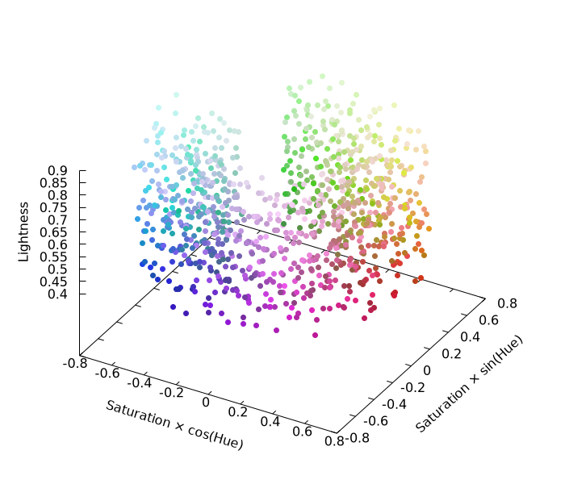

# Algorithm Documentation

## Overview

qualpal uses a farthest-point sampling algorithm in the DIN99d color space to
generate maximally distinct color palettes.

## Color Space Choice

### Why DIN99d?

DIN99d is a perceptually uniform color space that provides better color
difference estimation than alternatives:

- **Better than RGB**: RGB distances don't correlate with perceived differences
- **Better than Lab**: DIN99d has improved perceptual uniformity, especially
  for small differences
- **Optimized for visualization**: Designed specifically for color difference
  applications

### Color Space Pipeline

Input Colors → RGB → XYZ → Lab → DIN99d → Distance Matrix → Farthest Point
Sampling → Output ```

## Farthest Point Sampling

The algorithm selects colors that maximize the minimum distance between any
pair:

1. **Initialize**: Select the first color arbitrarily
2. **Iterate**: For each subsequent color, choose the one farthest from all
   previously selected colors
3. **Distance Metric**: Euclidean distance in DIN99d space

### Time Complexity

- **Preprocessing**: O(n²) to compute all pairwise distances
- **Selection**: O(kn) where k is the number of colors to select
- **Total**: O(n² + kn)

## Color Vision Deficiency Simulation

When CVD parameters are provided:

1. **Simulate**: Transform input colors using Brettel et al. (1997) model
2. **Measure**: Compute distances in the simulated color space
3. **Select**: Apply farthest-point sampling to simulated colors
4. **Return**: Original (non-simulated) colors corresponding to selected
   indices

This ensures the palette remains distinct for users with color vision
deficiencies.

## Blabla


