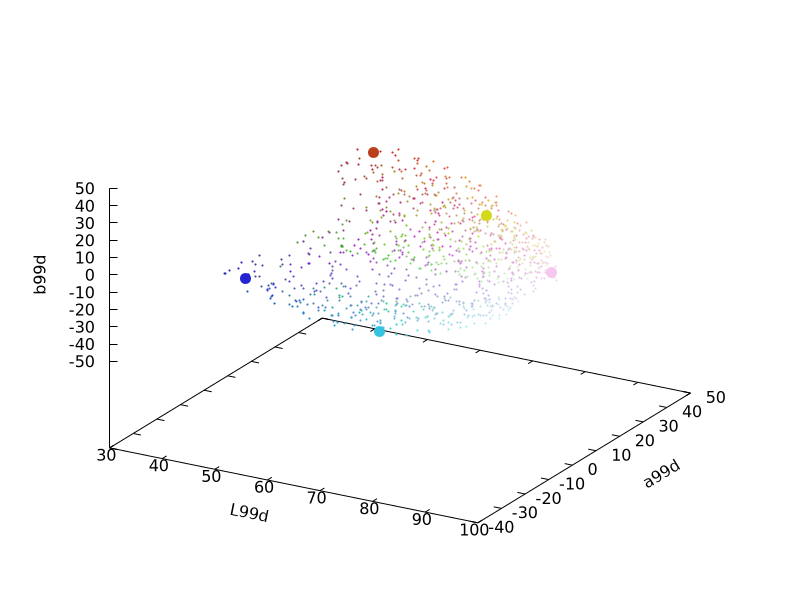

# The Algorithm {#algorithm}

## Overview

qualpal is designed to generate perceptually distinct color
palettes. It does so by starting wit a set of input (candidate) colors,
which can be either

- a predefined set of RGB colors (or any other colors that can be converted to RGB,
  e.g., hex colors or HSL colors),
- sampled from (part of) the HSL color space, or
- one of the predefined color palettes in the library, such as
  `"ColorBrewer:Set2"`

In case of the second option, qualpal uses a Halton pseudo-random sequence
to sample colors evenly from the HSL color space, ensuring a uniform distribution
of colors across the hue, saturation, and lightness dimensions.


The next step is to figure out which of the candidate colors are
maximally distinct from each other. To do so, we first need to measure
the distances between all candidate colors.

## Projecting into Uniform Color Space

In order to figure our which colors are maximally distinct, qualpal
constructs a distance matrix that contains the pairwise distances,
in terms of some color difference metric, between all candidate colors.

In the default case, qualpal does this by projecting the candidate colors (in
RGB space) into the DIN99d color space (Cui et al. 2002), which is a
perceptually uniform color space, which means that the Euclidean distances
between colors in this space correspond to the perceived color differences.
This makes computing the full color difference matrix efficient.
To further improve the distance metric, we also apply a power
function to the computed distances, as suggested by Huang et al. (2015).


qualpal can also use other color difference metrics, such as
CIEDE2000, which is current standard of the International Commission on
Illumination (CIE) for color difference measurement. Since this
formula is more complex than DIN99d (note based on Euclidean distances),
it is computationally more expensive to compute the distance matrix, but
may yield better results in some cases. In this case, colors are
instead projected into the Lab color space, before distances are
computed.

## Farthest Point Sampling

The problem of selecting a set of points (in our case colors) that are
maximally distinct is known as the max-min \f$k\f$-dispersion problem, which is
NP-hard. Even for, say, a required palette of 10 colors and 100 candidate
colors, solving this problem exactly would be intractable.

Instead, qualpal uses a heuristic algorithm based on the
basic idea of farthest point sampling in (Schlömer et al. 2011).
They used a Delaunay triangulation to compute the distances between
points, but qualpal uses a distance matrix directly instead.

The algorithm works as follows:

```
M <- Compute a distance matrix of all points in the sample
S <- Sample n points randomly from M
repeat
    for i = 1:n
        M    <- Add S(i) back into M
        S(i) <- Find point in M\S with max mindistance to any point in S
                until M did not change
```

Iteratively, we put one point from our candidate subset (S) back into the
original se (M) and check all distances between the points in S to those in
M to find the point with the highest minimum distance. Rinse and repeat until
we are only putting back the same points we started the loop with, which
always happens. Let's see how this works on the same data set we used above.

The algorithm is guaranteed to converge, and the result is a set of colors that
are (approximately) maximally distinct from each other, according to the
computed distance matrix.

For the running example, the algorithm would select the following colors.



You can see the computed color palette in the following image.


As far as the complexity of the algorithm is concerned, it is

- **Distance Matrix**: O(n²) for n candidate colors
- **Sampling**: O(n) to sample n colors from the distance matrix
- **Farthest Point Sampling**: O(kn²) where k is the number of colors to select
  (since we need to compute distances for each selected color against all others)

## Color Vision Deficiency Simulation

A key feature of qualpal is the ability to generate color palettes
that are accessible to people with color vision deficiencies (CVD).
To do so, qualpal simulated the effects of CVD on the input (RGB) colors
by applying a color vision deficiency model from Machado et al. (2009).
This model simulates the effects of protanopia, deuteranopia, and tritanopia
(or any combination of these) on the input colors, with selected severity.
The color difference matrix is then computed on the simulated colors,
ensuring that the resulting palette is accessible to people with CVD.

## Background Color

The motivating example for qualpal was to generate color palettes
for visualization of categorical data, in which case
there is typically a background color to consider as well. If
the colors are too bright, then they may not be visible against or dinstinc
enough from the background color. qualpal therefore also supports
specifying a background color, which ensures that the
selected colors are distinct from the background color as well.

## Aesthetic Considerations

One thing that qualpal does _not_ do is to consider aesthetic
considerations when selecting colors. It has no notion of
color harmony, complementary colors, or any other aesthetic
considerations. The focus is purely on maximizing the perceptual
distinctiveness of the selected colors.

If aesthetic considerations are important, however, then it is
also possible to use qualpal to improve on existing color palettes, for
instance by taking a predefined color palette (such as `"ColorBrewer:Set2"`),
and tweaking it by picking out (and ordering) the \f$n\f$ most distinct colors
as well as ensuring that the colors are distinct from a given background color
and accessible to people with color vision deficiencies.

Since input in hex format is supported, it is also easy to use qualpal
on any existing color palette outside of the library.

## References

- Cui, G., Luo, M. R., Rigg, B., Roesler, G., & Witt, K. (2002). Uniform
  colour spaces based on the DIN99 colour-difference formula. Color Research &
  Application, 27(4), 282–290. <https://doi.org/10.1002/col.10066>
- Huang, M., Cui, G., Melgosa, M., Sánchez-Marañón, M., Li, C., Luo, M. R., & Liu, H.
  (2015). Power functions improving the performance of color-difference formulas.
  Optics Express, 23(1), 597–610. <https://doi.org/10.1364/OE.23.000597>
- Machado, Gustavo. M., Oliveira, Manuel. M., & Fernandes, Leandro. A. (2009).
  A physiologically-based model for simulation of color vision deficiency.
  IEEE Transactions on Visualization and Computer Graphics, 15(6), 1291–1298.
  <https://doi.org/10.1109/tvcg.2009.113>
- Schlömer, T., Heck, D., & Deussen, O. (2011). Farthest-point optimized point
  sets with maximized minimum distance. Proceedings of the ACM SIGGRAPH
  Symposium on High Performance Graphics, 135–142.
  <https://doi.org/10.1145/2018323.2018345>
