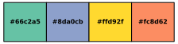
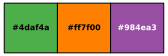
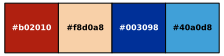
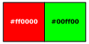
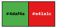
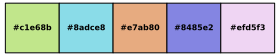

# Examples {#examples}

## Library Examples

Generate a palette from HSL color space.

```cpp
#include <qualpal.h>

qualpal::Qualpal qp;

qp.setInputColorspace({ -170, 60 }, { 0, 0.7 }, { 0.2, 0.8 });
auto hsl_pal = qp.generate(5);
```


Select colors considering color vision deficiency:

```cpp
qp.setInputPalette("ColorBrewer:Set2").setCvd({ { "deutan", 0.7 } });
auto cvd_pal = qp.generate(4);
```



Here we design a CVD-friendly version of the `"ColorBrewer:Set2"` palette
for a black background, selecting 3 colors.

```cpp
qp.setInputPalette("ColorBrewer:Set2")
  .setBackground(colors::RGB("#000000"))
  .setCvd({ { "tritan", 0.2 }, { "deutan", 0.5 } })
  .generate(3);
```


Generate a palette from custom RGB colors:

```cpp
qp.setInputRGB({
  colors::RGB("#e41a1c"), // Red
  colors::RGB("#377eb8"), // Blue
  colors::RGB("#4daf4a"), // Green
  colors::RGB("#984ea3"), // Purple
  colors::RGB("#ff7f00"), // Orange
});
auto rgb_pal = qp.generate(3);
```



Generate a palette using a predefined palette:

```cpp
qp.setInputPalette("Pokemon:Porygon");
auto palette = qp.generate(4);
```



## Command Line Examples {#examples-cli}

Generate 5 colors from HSL color space:

```bash
qualpal -n 5 -i colorspace "-170:60" "0:0.7" "0.2:0.8"
```


Select 2 colors from hex values:

```bash
qualpal -n 2 "#ff0000" "#00ff00" "#0000ff"
```



Output palette as comma-delimited values:

```bash
qualpal -n 4 --output-delim comma "#ff0000" "#00ff00" "#0000ff" "#ffff00"
```

```
#ff0000,#0000ff,#00ff00,#ffff00
```

Analyze a palette for color difference:

```bash
qualpal analyze --input hex "#ff0000" "#00ff00" "#0000ff"
```

    Color Difference Matrix (ciede2000 metric):
    Colors analyzed: 3
    Colors:
    Idx      Hex  MinDist
        0  #ff0000    52.88
        1  #00ff00    83.19
        2  #0000ff    52.88

    Color Difference Matrix:
            0       1       2
    0     0.00   86.61   52.88
    1    86.61    0.00   83.19
    2    52.88   83.19    0.00

Generate palette for a dark background

```bash
qualpal -n 2 --background "#000000" "#e41a1c" "#377eb8" "#4daf4a" "#984ea3"
```



Simulate color vision deficiency (CVD)

```bash
qualpal -n 4 --deutan 0.7 "#e41a1c" "#377eb8" "#4daf4a" "#984ea3"
```


Improve an existing palette and select subset

```bash
qualpal -n 3 -i palette "ColorBrewer:Set2" -b "#000000" --deutan 0.5 --tritan 0.2
```


A soothing pastel palette, generated from a HSL color space:

```bash
qualpal -n 5 -i colorspace "20:300" "0.3:0.7" "0.7:0.9"
```


