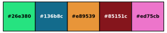

# Getting Started {#getting-started}

The main API of qualpal is a builder-style interface that allows you to
configure the color palette generation process step by step.

## Input Colorspace

The only required setting is the input color space, which defines the
set of colors that can be selected from. There are currently
three different ways to specify the input color space:

- **Colorspace**: Specify a subspace of either the HSL or LCHab (HCL)
  color spaces, by defining ranges for hue, saturation, and lightness (HSL)
  or hue, chroma, and lightness (HCL).
- **RGB**: Specify a set of RGB colors.
- **Predefined**: Use one of the predefined color palettes, such as
  `"Vermeer:PearlEarring"`.

To specify the input color space using HSL, you can define ranges for
hue, saturation, and lightness. For example, to create a color palette
with colors sampled from the HSL color space, you can use the following code:

```cpp
#include <qualpal.h>
using namespace qualpal;

auto pal = Qualpal{}
             .setInputColorspace({ -170, 60 }, { 0, 0.7 }, { 0.2, 0.8 })
             .generate(5);
```

In this case, qualpal will generate a number of color points (by default 1000)
in the specified HSL color space using a Halton pseudo-random sequence.


You can also specify the input color space using LCHab (HCL) by defining
ranges for hue, chroma, and lightness. For example:

```cpp
auto qp = Qualpal{}.setInputColorspace({ 0, 360 },
                                       { 20, 80 },
                                       { 30, 70 },
                                       ColorspaceType::LCHab);
```

Note that the ranges for lightness and chroma in LCHab are different from those
in HSL: \f$[0, 100]\f$ for lightness and \f$[0, \infty]\f$ for chroma.

To generate the actual colors, you can then call the `generate` method
with the desired number of colors:

```cpp
std::vector<colors::RGB> pal = qp.generate(5);
```

To specify the input color space using RGB, you can provide a list of RGB
colors. For example:

```cpp
qp.setInputRGB({ colors::RGB("#ff0000"),
                 colors::RGB("#00ff00"),
                 colors::RGB("#0000ff") });
```

And finally, to use a predefined color palette, you can
use the `setInputPalette` method:

```cpp
qp.setInputPalette("Pokemon:Porygon");
auto pal = qp.generate(4);
```


## Color Vision Deficiency

A key feature of qualpal is its ability to generate color palettes
that are accessible to users with color vision deficiencies (CVD).
In order to do this, qualpal projects the RGB colors into the
specific color vision deficiency space and then uses
these colors to generate the palette. At the moment,
qualpal supports CVD simulation for deuteranomaly, protanomaly,
and tritanomaly. You can specify the severity of the CVD
using a value between 0 and 1, where 0 means no CVD and 1 means
full CVD. For example, to generate a color palette
that is accessible to users with deuteranomaly, you can use the following code:

```cpp
auto cvd_pal = Qualpal{}
                 .setInputColorspace({ -50, 200 }, { 0.4, 0.8 }, { 0.3, 0.7 })
                 .setCvd({ { "deutan", 0.7 } })
                 .generate(5);
```



The simulation of color vision deficiency is based on the model
by Machado et al. (2009), and is numerically stable and fast.

## Background Color

When generating color palettes for visualizations, it is often important
to consider the background color against which the colors will be displayed.
This matters especially for scatter plots or other visualizations where
the canvas color is dominant. qualpal allows you to specify a background color
to ensure that the selected colors are distinct from it. You can set the background
color using the `setBackground` method:

```cpp
qp.setBackground(colors::RGB("#ffffff")); // white background
```

By default, the background color is _not_ considered, so if you want to
ensure that the selected colors are distinct from the background color,
you need to explicitly set it. This also makes it easy to use qualpal
for generating color palettes with a dark background, for instance:

## Palette Extension

You can extend an existing palette by keeping some colors fixed and adding more
distinct colors from a candidate set. For example:

```cpp
#include <qualpal.h>
using namespace qualpal;

std::vector<colors::RGB> fixed = {
  colors::RGB("#e41a1c"), // Red
  colors::RGB("#377eb8"), // Blue
};

std::vector<colors::RGB> input = {
  colors::RGB("#4daf4a"), // Green
  colors::RGB("#984ea3"), // Purple
  colors::RGB("#ff7f00"), // Orange
  colors::RGB("#ffff33"), // Yellow
};

auto ext_pal = Qualpal{}.setInputRGB(input).extend(fixed, 4);
```

`ext_pal` now contains the fixed colors plus two more distinct colors from
input.

## References

- Machado, Gustavo. M., Oliveira, Manuel. M., & Fernandes, Leandro. A. (2009).
  A physiologically-based model for simulation of color vision deficiency.
  IEEE Transactions on Visualization and Computer Graphics, 15(6), 1291–1298.
  <https://doi.org/10.1109/tvcg.2009.113>
